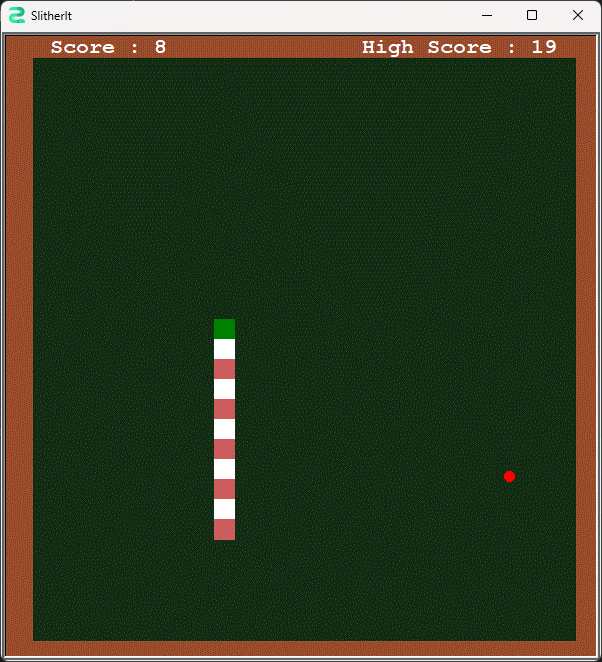

# Snake Game 🐍

## Overview 🌐

Snake Game is a classic arcade-style game built using Python's Turtle graphics module. The objective is to control the snake, represented by a series of connected blocks, and guide it to eat food while avoiding collisions with the walls and itself. The game becomes progressively challenging as the snake grows longer with each consumed food item.

## Gameplay 🎮

- Use the arrow keys (`↑`, `↓`, `←`, `→`) to control the snake's direction.
- The snake continuously moves in the current direction.
- Eat the food (green square) to grow longer.
- Avoid collisions with the walls and the snake's body.
- The game ends when the snake collides with the walls or itself.
- Press `Escape` to exit the game.

## Running the Game ▶️

To play the game, run the main file:

```bash
python main.py
```

## Preview 📸
